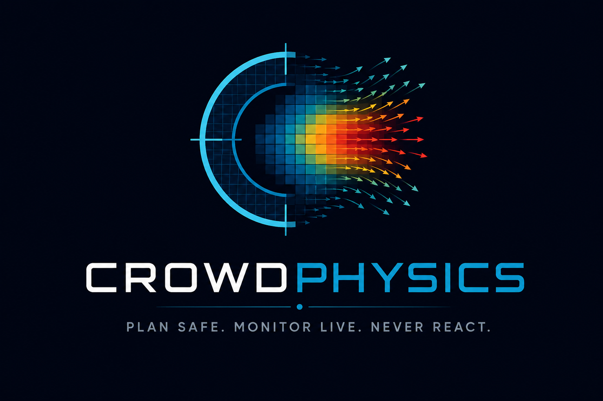
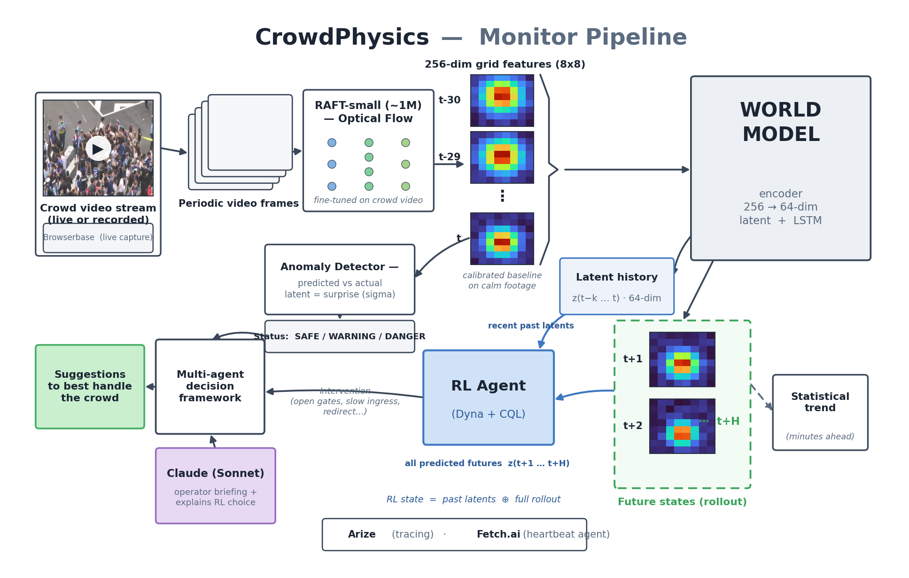
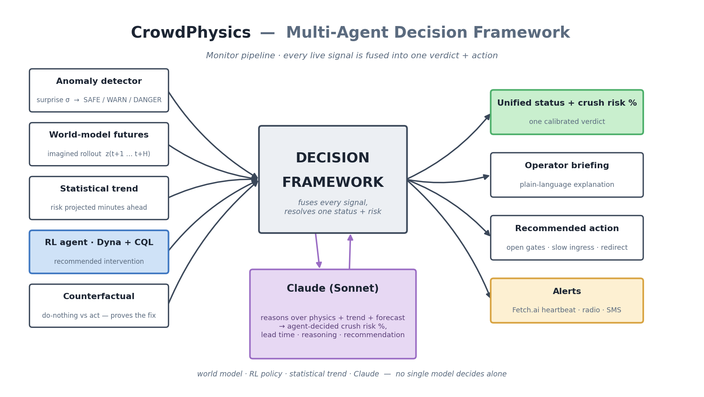
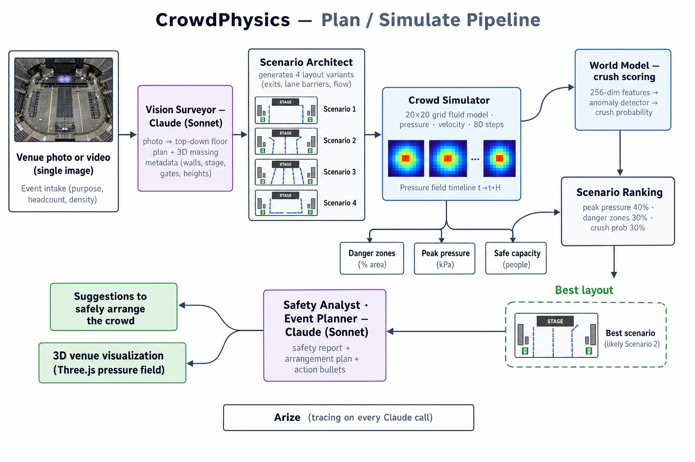
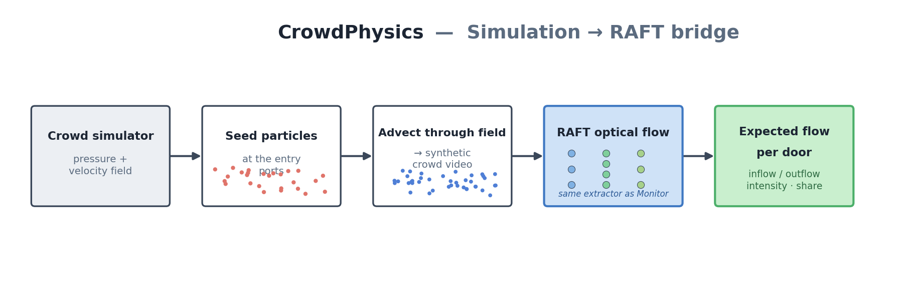
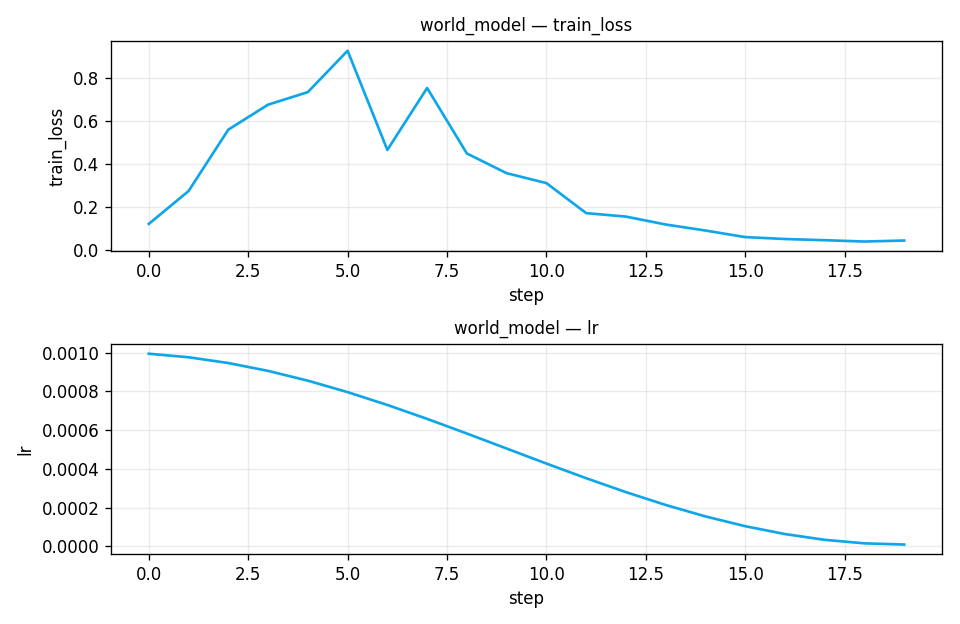
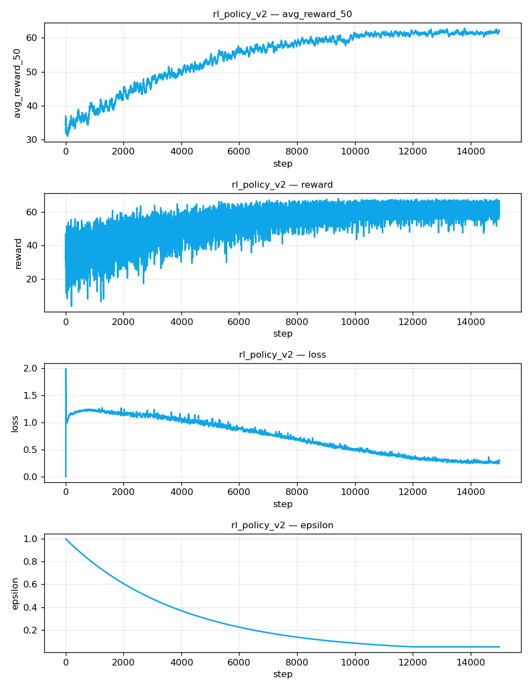

<div align="center">
  
</div>

# CrowdPhysics

**Live crowd-crush early warning + pre-event crowd-flow simulation — on cameras that already exist.**

A crush is a *physics* problem before it is a human one. By the time a camera operator sees people falling, it is already too late. CrowdPhysics reads a crowd as pure fluid dynamics, learns what "normal" looks like, and warns *before* the crush forms — and lets you simulate a venue's crowd flow before the event, through the same perception pipeline.

---

## What it does

CrowdPhysics is one platform with two modes:

- **Monitor mode (live).** Turns any CCTV stream, phone, or public webcam into a crush-risk early-warning system. It extracts optical flow, feeds it to a self-supervised world model, and forecasts what the crowd will do next. When the model becomes *surprised* — the crowd behaves in a way it never saw during calm footage — it raises a warning. Claude then explains what's happening, decides a calibrated crush-risk %, and recommends an action.

- **Simulate mode (pre-event).** Upload a photo or video of a venue; agents reconstruct it in 3D, fill it with a simulated crowd, and surface danger zones, Fruin level-of-service, and a safe arrangement plan. The **Sim → RAFT bridge** then renders the simulation as a synthetic-crowd video and runs it through the *same* optical-flow extractor used live — previewing the inflow/outflow each entrance and exit should show on the day.

The signature of the product is the visualization: instead of a red dot on a surveillance feed, the crowd is rendered as a CFD-style pressure field. The people disappear, and only the physics remains.

> It learned crowd physics on its own — a linear probe of the unlabeled latent space recovers crowd velocity (R² 0.83), turbulence (0.78), backward pressure (0.84), and **boundary stress — the literal mechanism of a crush — at R² 0.94**, without ever being told what a wall is.

---

## Architecture

Two modes share one perception core — optical flow → a learned world model → an anomaly signal — and one explainer (Claude).

### Monitor pipeline — frame to warning

Every frame pair becomes an optical-flow field → a 256-d feature vector → a 64-d latent `z` → an autoregressive rollout. The gap between predicted and actual is the danger signal.



At the end of the pipeline, a **multi-agent decision framework** fuses every signal — no single model decides alone.



### Simulate pipeline — photo to safe layout



### Sim → RAFT bridge — validate a layout through the same eyes that will watch it



---

## Tools used

| Layer | Stack |
| --- | --- |
| **Perception** | PyTorch · RAFT (`torchvision`, optionally fine-tuned `raft_crowd.pt`) with a Farneback fallback |
| **World model** | Latent dynamics — CNN/MLP encoder + stochastic LSTM transition, 256 → 64-d latent (RSSM v2 explored, v1 shipped) |
| **Decision (RL)** | Dyna-style model-based RL with Conservative Q-Learning (CQL), trained in imagination |
| **Agent / LLM** | Claude (Sonnet) via Anthropic — vision reconstruction, behavior planning, safety reports, agent-decided live risk |
| **Live capture** | Browserbase (cloud headless browser) · yt-dlp · OpenCV |
| **Simulation** | Pressure-grid CFD crowd model — time-varying arrivals, density-dependent speed, Fruin LOS |
| **Observability** | Arize AX (OpenTelemetry tracing + LLM-as-judge evals) |
| **Alerts** | Fetch.ai heartbeat agent · Slack / Discord / webhook / Twilio SMS |
| **App** | FastAPI (backend) · Next.js + React Three Fiber / Three.js · Recharts · Tailwind |

---

## Dataset

The world model and the RAFT fine-tuning are trained on a small set of **publicly available YouTube clips of crowds walking and moving** — stadium crowds, pedestrian flows, and crowd-dynamics demonstrations. The clips live in `data/videos/` and are loaded directly by the training scripts (`scripts/train.py`, `scripts/finetune_raft.py`).

Two things to note:

- **No labels, no disaster footage.** Training is entirely **self-supervised** on *normal* crowd motion — the model only ever learns what calm looks like, and danger is inferred as deviation ("surprise") from that. Real crush footage is scarce and ethically fraught, so none is used.
- **Intentionally small (hackathon scope).** A handful of clips is enough to demonstrate the pipeline and recover physics via the latent probe, but it's also why held-out generalization is modest — broader, more varied footage is the obvious next step.

To use your own data, drop `.mp4` / `.avi` / `.mov` files into `data/videos/` and re-run the training scripts below.

---

## Model results

All numbers are reproducible from the scripts in `scripts/` and the JSON artifacts in `results/`.

### Latent probe — did the world model learn physics?

We freeze the shipped world model (v1), encode crowd video into the 64-d latent, and fit a probe from the latent to each *measured* physics quantity. High R² means the concept is linearly recoverable from the latent the model built on its own.

| Concept | R² (linear, in-sample) | R² (held-out, group k-fold) |
| --- | --- | --- |
| Crowd velocity | 0.83 | 0.54 |
| Turbulence | 0.78 | 0.33 |
| Backward pressure | 0.84 | 0.56 |
| **Boundary stress** (the literal mechanism of a crush) | **0.94** | 0.26 |

Plus the unexplained latent dimensions still separate pre-anomaly frames from calm ones by **1.56σ** — early-warning signal the model encodes that we don't yet have names for. The in-sample numbers show the concept *is* represented; the held-out numbers are honest about how much generalizes from this small dataset. *(Source: `results/probe_results.json`, `scripts/probe_latent.py`.)*

### Model selection — v1 vs RSSM v2

We built a Dreamer/RSSM-style v2 and compared it to v1 on a combined probe + surprise-separation score. **v1 won and shipped.**

| Model | Mean linear-probe R² | Surprise separation | Combined score |
| --- | --- | --- | --- |
| **v1 (shipped)** | 0.85 | **1.56σ** | **1.63** |
| RSSM v2 | 0.87 | 1.25σ | 1.49 |

*(Source: `results/probe_compare_results.json`, `scripts/probe_compare.py`.)*

### Training curves (selected models)

**World model (v1, shipped)** — self-supervised loss (reconstruction + KL + transition) converging to ≈ **0.045** under cosine LR decay:



**Intervention RL (Dyna + Conservative Q-Learning)** — trained entirely in the world model's imagination. Over 15k imagined episodes the 50-episode average reward climbs to ≈ **62** (best ≈ 68) as the TD/CQL loss decays and ε anneals:



*(Curves written live by `metrics_logger.py`; sources in `logs/`.)*

---

## Getting started

### Prerequisites

- Python 3.10+ and Node.js 18+
- An [Anthropic API key](https://console.anthropic.com/) (required for the Claude-powered features)

### 1. Backend (FastAPI · port 8000)

```bash
# from the repo root
python3 -m venv .venv && source .venv/bin/activate
pip install -r backend/requirements.txt

# add your keys (see "Environment" below)
echo 'ANTHROPIC_API_KEY=sk-ant-...' > .env

# run the API (loads the world model + RL policy at startup)
python3 backend/main.py
```

The API serves on `http://localhost:8000`.

### 2. Frontend (Next.js · port 3000)

```bash
cd frontend
npm install
npm run dev
```

Open **http://localhost:3000**. The UI talks to the backend at `http://localhost:8000` by default (override with `NEXT_PUBLIC_API_URL`).

### Environment

Create a `.env` in the repo root (auto-loaded by the backend). Only `ANTHROPIC_API_KEY` is required:

```bash
ANTHROPIC_API_KEY=sk-ant-...          # required — Claude reasoning & vision

# optional — live webcam/stream capture via Browserbase
BROWSERBASE_API_KEY=...
BROWSERBASE_PROJECT_ID=...

# optional — tracing + evals
ARIZE_API_KEY=...
ARIZE_SPACE_ID=...

# optional — outbound alerts
SLACK_WEBHOOK_URL=...
# DISCORD_WEBHOOK_URL / ALERT_WEBHOOK_URL / TWILIO_* + ALERT_SMS_TO also supported
```

> Tip: for a fast local demo with no GPU, force the classical flow backend:
> `CROWDPHYSICS_FLOW_BACKEND=farneback python3 backend/main.py`

---

## Using it

- **Monitor** — open the Monitor tab and paste a live stream / webcam / YouTube URL. Analysis auto-starts and loops; watch the live feed, the synchronized pressure field, the crush-risk forecast, and the agent's reasoning. Danger regions are marked directly on the frame.
- **Plan** — open the Plan tab, upload a photo or video of a space, and answer a few questions (purpose, crowd size, density). Agents reconstruct the venue in 3D, simulate the crowd, rank layout scenarios, and run the **Expected Entry/Exit Flow** check (Sim → RAFT). Refine the scene in plain language ("add an exit on the north wall").

---

## Repository layout

```
backend/            FastAPI app (main.py), API endpoints, streaming
frontend/           Next.js + Three.js UI
flow_extractor.py   RAFT / Farneback optical flow + pressure-field render
world_model.py      World model v1 — CNN/MLP encoder + LSTM transition
anomaly_detector.py surprise σ scoring + status
dyna_trainer.py     model-based RL (Dyna + CQL)
simulation_engine.py  pressure-grid crowd simulator + Sim→RAFT frames
claude_interpreter.py Claude agents (vision, planning, risk, reports)
agents/             Browserbase / YouTube capture, Fetch.ai heartbeat
scripts/            training, fine-tuning, and latent-probe scripts
models/             trained checkpoints loaded at startup
devpost/            architecture diagrams + demo deck
```

### Training (optional)

The repo ships with trained checkpoints in `models/`. To retrain:

```bash
python3 scripts/train.py            # world model + RL policy
python3 scripts/finetune_raft.py    # self-supervised RAFT on crowd video
python3 scripts/probe_latent.py     # verify the latent learned physics (R²)
```

---

## Diagrams & deck

Architecture diagrams are reproducible matplotlib sources in `devpost/` (`architecture.py`, `decision_framework.py`, `bridge_architecture.py`). The demo deck lives at `devpost/CrowdPhysics_Demo.pptx` (regenerate with `python3 devpost/make_deck.py`).

---

<div align="center">
  <strong>Plan safe. Monitor live. Never react.</strong>
</div>
